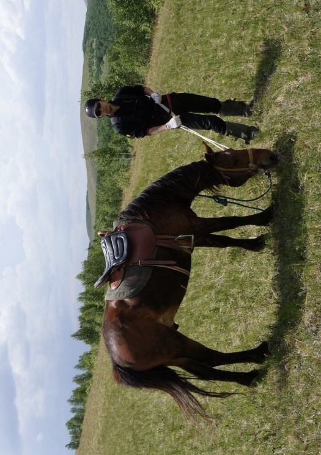

<blockquote class="blockquote-center">
我爱大自然，其次就是艺术 
我双手烤着生命之火取暖 
火萎了，我也准备走了 
我不能选择怎么生，怎么死 
我可以决定怎么爱，怎么活
</blockquote>

## 一

假如一天已经过去了，鸟儿也不歌唱，假如风也吹倦了，那就用黑暗的厚幕把我盖
上罢，如同你在黄昏时节用睡眠的衾被裹上大地，又轻柔地将睡莲的花瓣合上。
旅客的行程未达，粮袋已空，衣裳破裂污损，而又筋疲力尽，你解除了他的羞涩与
困窘，使他的生命像花朵一样在仁慈的夜幕下苏醒。

## 二

若是你不说话，我就含忍着，以你的沉默来填满我的心。
我要沉静地等候，像黑夜在星光中无眠，忍耐地低首。
清晨一定会来，黑暗也要消隐，你的声音将划破天空从金泉中下注。
那时你的话语，要在我的每一鸟巢中生翼发声，你的音乐，要在我林丛繁花中盛开怒放。

## 三

我只在等候着爱，要最终把我交在他手里。这是我迟误的原因，我对这延误负咎。
他们要用法律和规章，来紧紧地约束我；但是我总是躲着他们，因为我只等候着爱，要最终把我交在他手里。
人们责备我，说我不理会人；我也知道他们的责备是有道理的。
市集已过，忙人的工作都已完毕。叫我不应的人都已含怒回去。我只等候着爱，要最终把我交在他手里。

## 四

在这暴风雨的夜晚你还在外面作爱的旅行吗，我的朋友？
天空像失望者在哀号。
我今夜无眠。我不断地开门向黑暗中了望，我的朋友！
我什么都看不见。我不知道你要走哪一条路！
是从墨黑的河岸上，是从远远的愁惨的树林边，是穿过昏暗迂回的曲径，你摸索着来到我这里吗，我的朋友？

## 五

只要我一息尚存，我就称你为我的一切。
只要我一诚不灭，我就感觉到你在我的四围，任何事情，我都来请教你，任何时候
都把我的爱献上给你。
只要我一息尚存，我就永把你藏匿起来。
只要把我和你的旨意锁在一起的脚镣，还留着一小段，你的意旨就在我的生命中实
现－－这脚镣就是你的爱。

## 六

在那里，心是无畏的，头也抬得高昂；
在那里，知识是自由的；
在那里，世界还没有被狭小的家国的墙隔成片段；
在那里，话是从真理的深处说出；
在那里，不懈的努力向着“完美”伸臂；
在那里，理智的清泉没有沉没在积习的荒漠之中；
在那里，心灵是受你的指引，走向那不断放宽的思想与行为－－进入那自由的天国，
我的父呵，让我的国家觉醒起来罢。